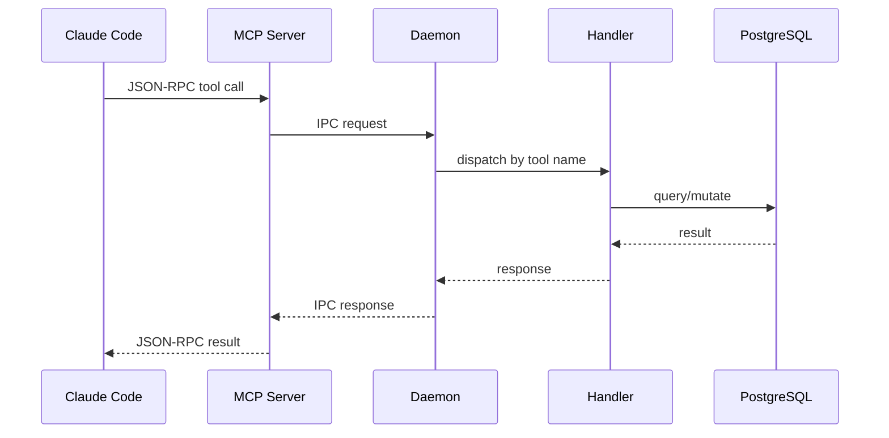

# Architecture Manifests

AI Agent pathfinder maps. Each YAML file describes the architecture skeleton
of one project so an agent can triage issues quickly: read the YAML → locate
the relevant module → read the trait/interface → read the implementation.

## When to update

- crate/module added or removed
- trait signature change
- data flow change
- deployment topology change

## Projects

| Project  | File                          | Stack                        | Description                          |
|----------|-------------------------------|------------------------------|--------------------------------------|
| MissionD | [missiond.yaml](missiond.yaml) | Rust + Tokio + PostgreSQL    | Claude Code multi-instance orchestration |

Only the MissionD self-manifest is bundled with the public build. Operators
may drop additional `<project>.yaml` files into this directory and wire them
up in `crates/missiond-daemon/src/workers/sonnet/arch_maintenance_worker.rs`.

## Data flow: MCP tool call

