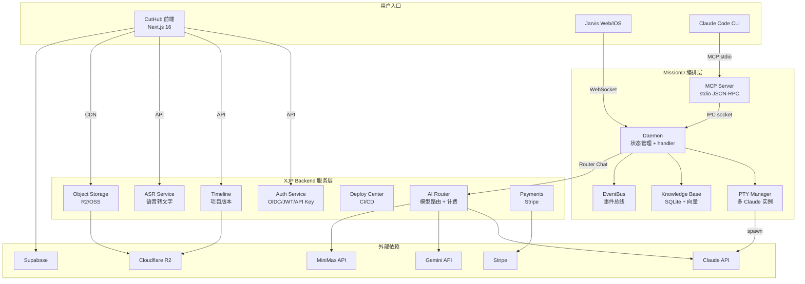
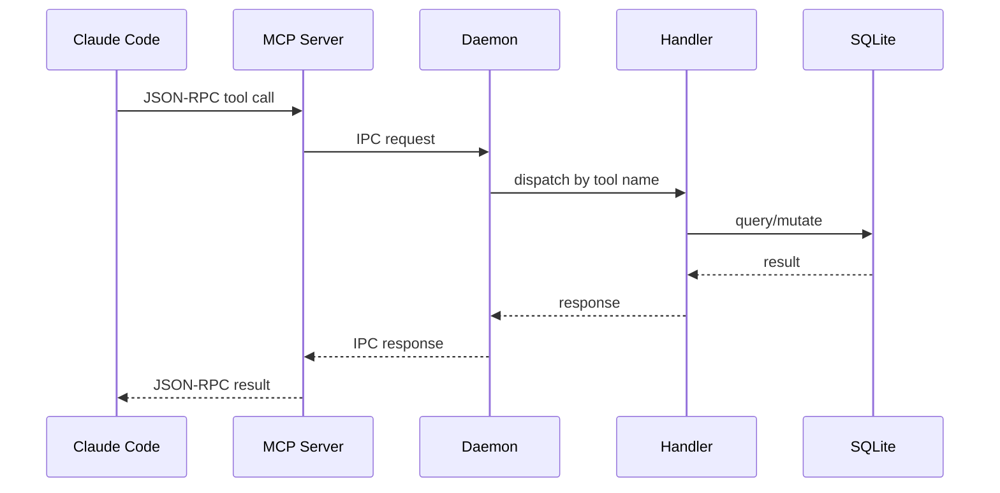
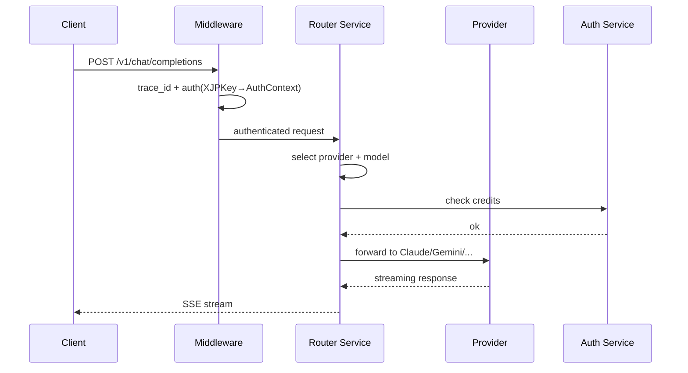
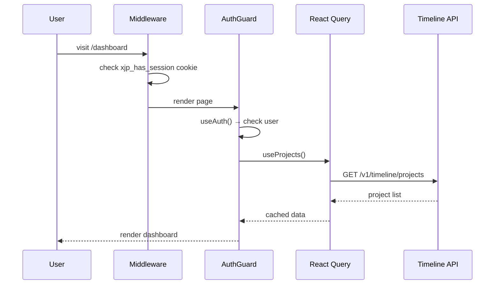

# Architecture Manifests

AI Agent 寻路地图。每个 YAML 文件描述一个项目的架构骨架。

## 使用方式

**AI Agent 排查问题时**：先读对应项目的 YAML → 定位模块 → 读 trait/interface → 读实现

**更新时机**：crate/module 新增删除、trait 签名变更、数据流变更、部署拓扑变更

## 项目索引

| 项目 | 文件 | 技术栈 | 描述 |
|------|------|--------|------|
| MissionD | [missiond.yaml](missiond.yaml) | Rust + Tokio + SQLite | Claude Code 多实例编排 |
| CutHub | [cuthub.yaml](cuthub.yaml) | Next.js 16 + React 19 | 视频编辑协作平台 |
| XJP Backend | [xjp-backend.yaml](xjp-backend.yaml) | Rust + Axum + PostgreSQL | 微服务后端核心 |

## 系统全景

## 数据流速查

### MissionD: MCP 工具调用

### XJP Backend: AI 路由

### CutHub: 页面加载

